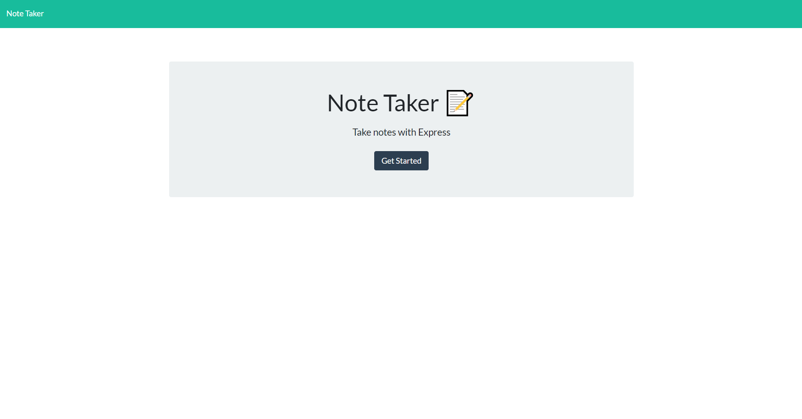

# Note Taker Application

  ## Description

  Application  accepts user input for notes including a note title/description. Server side the application processes reading of existing/saved notes, pushing new notes to page/server, and deleting existing notes.
  
  
  
  
  ## Table of Contents 
  
  
  - [Description](#description)
  - [Installation](#installation)
  - [Usage](#usage)
  - [License](#license)
  - [Contribution](#contribution)
  - [Testing](#testing)
  - [Questions](#questions)
  - [Credits](#credits)
  
  
  ## Installation
  Download files from github, open in console/node. Run NPM install to install depedencies. Run npm start to start server. OR visit Heroku link to run via webpage
  
  ## Usage
  Run npm start to run server.js

  ## License
  MIT License

  https://choosealicense.com/licenses/mit/

  ---
  
  

  ## Testing
  

  ## Questions
  Github Profile: www.github.com/jcgasper
  Email: jacobgasper@gmail.com

 
  ## Additional Info
  Created using Javascript/Node/Express

  ## Credits:

  Jacob Gasper

  [Github Repo](https://github.com/jcgasper/Note-Taker-Application "Github Repo")
  

  [Heroku Application](https://still-plains-33051.herokuapp.com/ "Heroku Application");